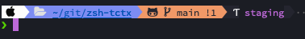

# zsh-tctx

Prompt for zsh that displays the current [tctx](https://github.com/jlegrone/tctx) context.

zsh's robbyrussell theme


p10k theme



## Installation

### Oh My Zsh

This will add the tctx context to the right of your prompt.

1. Clone this repository into `$ZSH_CUSTOM/plugins` (by default `~/.oh-my-zsh/custom/plugins`)

    ```sh
    git clone https://github.com/sikian/zsh-tctx ${ZSH_CUSTOM:-~/.oh-my-zsh/custom}/plugins/zsh-tctx
    ```

2. Add the plugin to the list of plugins for Oh My Zsh to load (inside `~/.zshrc`):

    ```sh
    plugins=( 
        # other plugins...
        zsh-tctx
    )
    ```

3. Start a new terminal session.

### Powerlevel10k

If you're using [powerlevel10k](https://github.com/romkatv/powerlevel10k)
(highly recommended!), you can extend it with the tctx prompt as follows.

1. Clone this repository 

    ```sh
    git clone https://github.com/sikian/zsh-tctx ~/.zsh/zsh-tctx
    ```

2. Add the prompt to your `~/.p10k.zsh`. 
 
    a. Add `tctx` to whichever `PROMPT_ELEMENTS` you prefer. Example:
    ```sh
    typeset -g POWERLEVEL9K_LEFT_PROMPT_ELEMENTS=(
      # =========================[ Line #1 ]=========================
      os_icon
      dir
      vcs
      tctx                    # tctx prompt!
      # =========================[ Line #2 ]=========================
      newline
      prompt_char
    )
    ```
 
    b. Search for `POWERLEVEL9K_EXAMPLE_BACKGROUND` and source `$HOME/.zsh/zsh-tctx/p10k-tctx.zsh` after:
    ```sh
    ...
    typeset -g POWERLEVEL9K_EXAMPLE_BACKGROUND=1

    # Source tctx prompt function
    source $HOME/.zsh/zsh-tctx/p10k-tctx.zsh
    ...
    ```

3. Start a new terminal session.

### Manual (Git Clone)

1. Clone this repository somewhere on your machine. This guide will assume `~/.zsh/zsh-tctx`.

    ```sh
    git clone https://github.com/sikian/zsh-tctx ~/.zsh/zsh-tctx
    ```

2. Add the following to your `.zshrc`:

    ```sh
    source ~/.zsh/zsh-tctx/zsh-tctx.zsh
    ```

3. Start a new terminal session.

## Customization

If you'd rather have other colours, you can either change the source code or
just change the following env vars to whatever suits you best:

```sh
ZSH_TCTX_PROMPT_PREFIX
ZSH_TCTX_PROMPT_PREFIX_STYLE
ZSH_TCTX_PROMPT_PROD_STYLE
ZSH_TCTX_PROMPT_DEFAULT_STYLE
```
